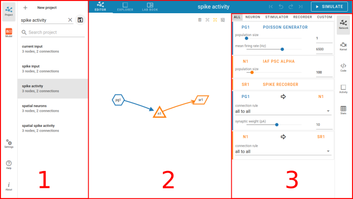

Concept of the interface
========================

.. _general-layout-concept-of-the-interface:

**General layout concept of the interface**

NEST Desktop consists of three segments with different purposes.

   The layout of NEST Desktop with the three main areas (1) - (3).

The left column (1) shows the navigation to route pages.
The center area (2) renders the main content of the page,
whereas the right column (3) displays the controller for the modification of the content.

.. _pages:

**Pages**

NEST Desktop has three router views (Project, Model, Settings).
The icons buttons on the left side navigate to these views.

.. _page-colors:

**Page colors**

The color code was taken from `Adobe <https://color.adobe.com/de/create/color-wheel>`__.
The colors of the pages are taken from the split complementary of the NEST default color (#ff6633).

.. _navigation-sidebar-left:

**Navigation sidebar (left)**

The navigation shows either projects or models.

.. _router-view-center:

**Router view (center)**

The router view renders the page content via the URL.
The project page displays a tab containing the network editor, the activity explorer and the lab book.
The model page shows the model description which can be used in NEST Simulator.
The setting page shows an overview of all settings for various components of the app.

.. _controller-view-right:

**Controller sidebar (right)**

The controller enables users to change values or configurations.
The network controller displays a list of nodes and connections with their parameters.
