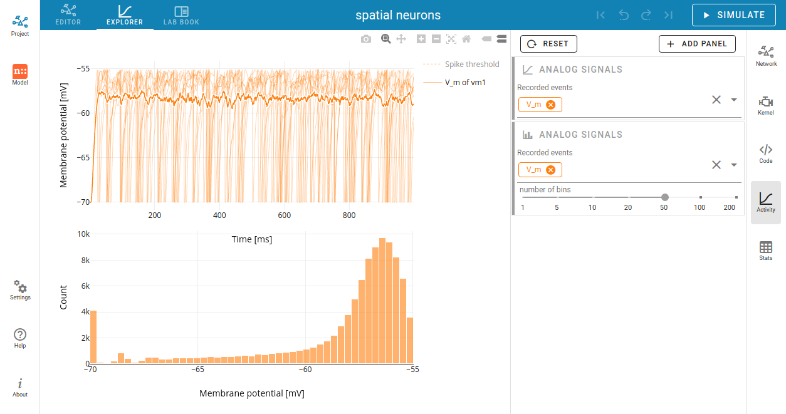
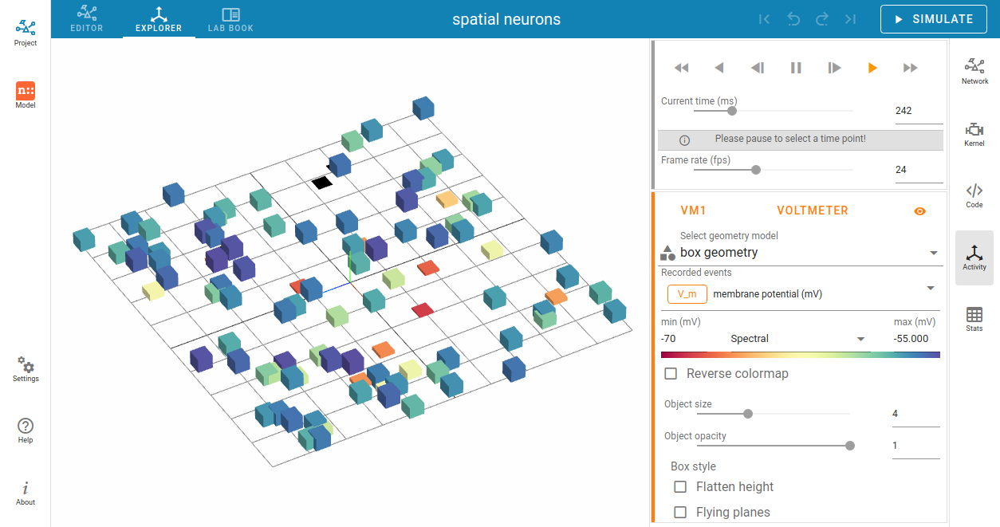

Activity graph
==============

Analog signals
--------------

Analog signals contain continuous quantities from the recording devices (``voltmeter`` or ``multimeter``).

.. _chart-graph-of-analog-signals:

Chart graph of analog signals
.............................

In the chart graph area, it is possible to visualize analog signals statically.
Every chart panel has an own controller card fur individual customization.
Other chart models can be chosen individually for each panel
by clicking on the card toolbar in the activity controller (on the right side).

By default it shows traces of the analog signals as a function of time.
A panel with a histogram of values can be added when you select it in the :guilabel:`+ ADD PANEL` dropdown menu.

You can add more recorded signals to the panel when it comes from ``multimeter``.
Node records appear as chips in the cards, which allow you to change the colors of the corresponding traces and bars.

|

.. _animation-graph-of-analog-signals:

Animation graph of analog signals
.................................

It is possible to display an animated 3D graph for the spatial network forming layers in topology
whose neurons have geographical positions.

Values of the analog signals can be visualized using the colors of recorded targets.
Here, it shows the color map ``spectral`` for the value scales (from min to max).
You can change the color map in the dropdown menu between the input fields of the min and max values.

Additionally, an other geometry model (box or sphere) can be chosen.

We recommend trying out many different options
for the animation graph to find the best representation,
as the optimal ones depend heavily on the simulation data
and the intended use of the visualization.

|

Spike activity
--------------

Spike events contain times and ids of the senders collected by the ``spike recorder``.

.. _chart-graph-of-spike-activity:

Chart graph of spike activity
.............................

.. image:: ../_static/img/screenshots/activity-chart-graph-spike.png
  :target: #chart-graph-of-spike-activity

By default, a raster plot of the spike times as well as a histogram for spike times is shown.

Further panel models are:

 - histogram of spike senders,
 - histogram of interspike-intervals and
 - histogram of coefficient of variation (:math:`CV_{ISI}`).

|

.. _animation-graph-of-spike-activity:

Animation graph of spike activity
.................................

.. image:: ../_static/img/screenshots/activity-anim-graph-spike.png
  :target: #animation-graph-of-spike-activity

Spikes can be visualized as transient blobs appearing in the 3D animated graph.
To follow spike activity better, the trail length can be increased.

Optionally, trails can be faded after the spike time,
and a growing or shrinking mode can also be applied.
