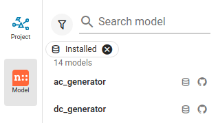
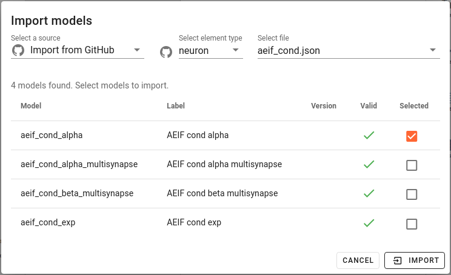
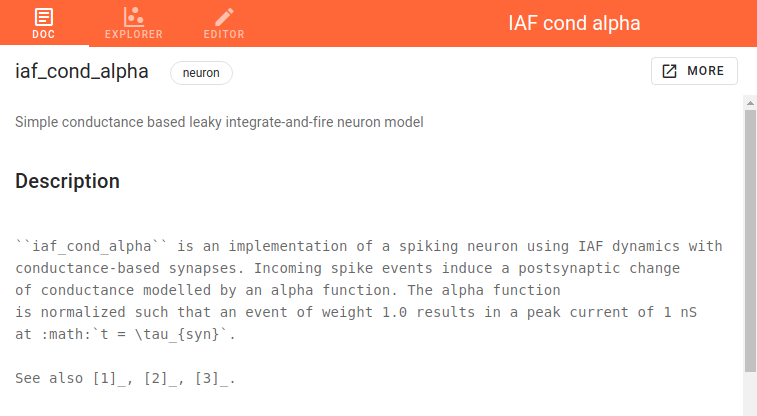
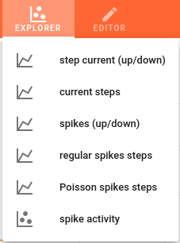
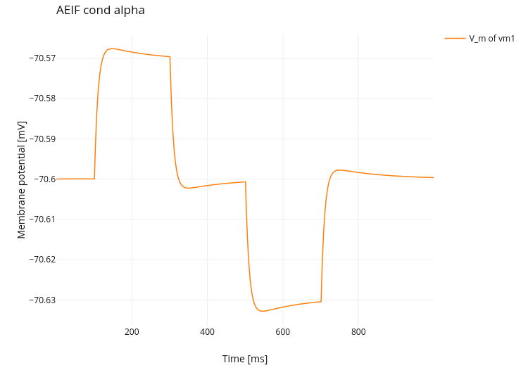

NEST models
===========

This is a guide for the NEST models
(e.g. neurons, simulator or synapses) in NEST Desktop.

Next to project section, you can visit the model section to

  - read model documentation
  - explore model activity or
  - edit the model configuration.

|br|

**Navigation list**

Models are enlisted in the right side navigation bar.
You can select a model to read its documentation its activity or to edit its configuration.

Above of model list you find search field and tags which you can filter models in the list.
Selected filter tags appears as chips under the search fields.

To select a tag you click on `filter` icon left to the search field.
Multiple filter tags can be applied.
Selected filter tags can be removed (click on close icon :guilabel:`x`).

|br|

**Filter tags for displaying models in the list**

.. image:: ../_static/img/screenshots/models-filter-tag.png
  :align: right

Installed:
  Show models which are installed in NEST Desktop

GitHub:
  Show models which are provided on GitHub repository which is hosted on https://github.com/nest-desktop/nest-desktop-models.

Neuron/stimulator/recorder/synapse:
  Show models of the selected element type.

|br|

**Model menu**

.. image:: ../_static/img/screenshots/models-menu.png
  :align: left

By clicking the right mouse button on model icon a menu appears
that you can select an option for models.

|br|

**Import model(s)**

You can import models from various sources,
e.g. an uploaded file from you computer, a file from GitHub repository or from specific URL.

.. note::
  Model files should be formatted in JSON.

When you select ``Import from GitHub``, choose a element type
and then a JSON file of your desired model group which includes all functions of synapse currents.

The table shows a list of models, which you can select to import.

|br|

||||

**Documentation**

The model documentation shows help text of an model requested from the NEST Simulator directly.
It contains only raw text and, thus, no formats of equations, tables and links.
The button :guilabel:`MORE` directs to official (styled) documentation of NEST Simulator.

|br|

**Explore activity of a neuron model**

You can explore the activity dynamics of neuron models.
First choose a simulation to see the neuronal response to specific stimulus device.

Then start the simulation by clicking on the :guilabel:`Simulate` button.

You can use code editor to see changes in activity.

.. note::

  It is important to disable the simulation with Insite.

|br|

**Model editor**

The model editor allows you to make changes in parameter specifications,
e.g. default value, unit, label or inputs.

.. image:: ../_static/img/screenshots/model-editor.png

.. |br| raw:: html

  

