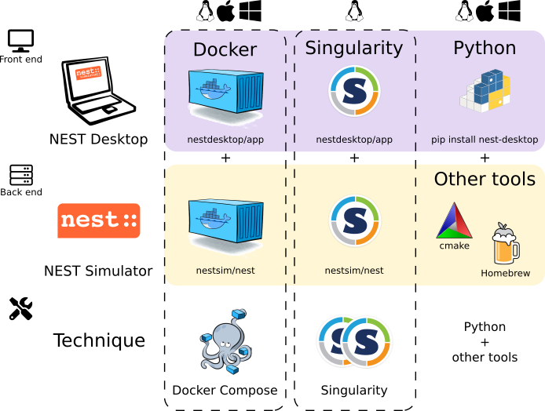
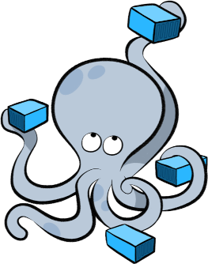

Setup Guide
===========

This guide provides a detailed documentation on how to install NEST Desktop with NEST Simulator.
The front end NEST Desktop requires NEST Simulator as the back end for the simulation.
NEST Simulator has an API Server which can forward requests to the simulation engine.
For more information, please have a look :doc:`here <nest-simulator:nest_server>`.

|

Docker (or Docker Compose) and Singularity provide both NEST Desktop and NEST Simulator,
so you have everything you need to run NEST Desktop.

Alternatively, you can install NEST Desktop with the pip command.
If you only have NEST Desktop (i.e., NEST Simulator is not running as back-end),
you can create networks but cannot run simulations within the application.
To enable the full functionality of NEST Desktop,
you also need to install NEST Simulator on your computer and run NEST Server.

See instructions below for details.

||||

Via Docker Compose |linux| |windows| |apple|
--------------------------------------------

|

Docker is a virtualization software packaging applications and its dependencies.
Docker Compose is a tool for running multi-container applications on Docker defined using the Compose file format.
To get more information, see the `official page of Docker Compose <https://github.com/docker/compose>`__.

|

.. _windows-windows-and-macos-apple:

**Windows** |windows| **and macOS** |apple|

Docker Compose is included in Docker Desktop for Windows and macOS.
For more information take a look at the `installation guide of Docker Desktop <https://www.docker.com/get-started>`__.

Please keep in mind that on Windows you can also use the Windows Subsystem for Linux (WSL) version 2 or higher,
which allows you to run Docker without emulation.
This offers performance advantages and more features.
Detailed instructions on how to use Docker on WSL (version 2+) are provided by
`Docker <https://docs.docker.com/desktop/windows/wsl/>`__ and
`Microsoft <https://docs.microsoft.com/en-us/windows/wsl/tutorials/wsl-containers>`__.

|

.. _quick-setup-in-linux-linux:

**Quick setup in Linux** |linux|

1. Install Docker and Docker Compose

.. code-block:: bash

  apt install docker.io docker-compose

2. Get configuration file for Docker-compose
(`docker-compose.yml <https://raw.githubusercontent.com/nest-desktop/nest-desktop/main/docker-compose.yml>`__)

.. code-block:: bash

  wget https://raw.githubusercontent.com/nest-desktop/nest-desktop/main/docker-compose.yml

3. Build and start NEST Desktop and NEST Simulator with a single command:

.. code-block:: bash

  sudo docker-compose up --build

Now NEST Desktop is started.
You can use NEST Desktop in the web browser at http://localhost:8000.

**The installation is now complete!**
:doc:`Now we can start constructing networks for the simulation! <usage>`

.. note::
  For more information (like running the containers without root password, etc.),
  please read the full documentation of `NEST Desktop Docker <https://github.com/nest-desktop/nest-desktop-docker>`__.

|

Via Singularity |linux|
-----------------------

.. image:: ../_static/img/logo/singularity-logo.svg
  :width: 240px
  :target: #via-singularity

|

Singularity is an application container for **Linux** systems.
For more information read the full documentation of Singularity
`here <https://sylabs.io/docs/>`__.

1. Clone a working copy from the repository and go to the folder:

.. code-block:: bash

  git clone https://github.com/nest-desktop/nest-desktop-singularity
  cd nest-desktop-singularity

2. Register the bash command for NEST Desktop Singularity:

.. code-block:: bash

  export PATH=$PATH:$PWD/bin/

.. note::
  You will have to repeat this every time you end a terminal session.
  If you like to register this command permanently,
  please proceed according to the `full documentation <https://github.com/nest-desktop/nest-desktop-singularity>`__.

3. Build the Singularity images (it will ask for sudo password):

.. code-block:: bash

  nest-desktop-singularity build

.. note::
  This command (and the following ones) need to be executed inside the folder where the container files are located,
  i.e. the `nest-desktop-singularity` folder.

4. Start the Singularity instances of NEST Desktop and NEST Simulator:

.. code-block:: bash

  nest-desktop-singularity start

Now NEST Desktop is started.
You can use NEST Desktop in the web browser at http://localhost:8000.

**The installation is now complete!**
:doc:`Now we can start constructing networks for the simulation! <usage>`

For more information read the full documentation of `NEST Desktop Singularity <https://github.com/nest-desktop/nest-desktop-singularity>`__.

|

Via Python Package |linux| |windows| |apple|
--------------------------------------------

.. image:: ../_static/img/logo/pypi-logo.svg
  :width: 240px
  :target: #via-python-package

|

NEST Simulator cannot be installed via pip (`maybe soon <https://github.com/nest/nest-simulator/pull/2073>`__).
Therefore, we need to install it in another way.

1. Install NEST Simulator (SKIP THIS STEP IF YOU HAVE NEST 3 INSTALLED.):

Read the full installation guide of NEST Simulator :doc:`here <nest-simulator:installation/index>`.

We highly recommend installing NEST 3. With NEST 3, the API server (i.e., NEST Server) is already implemented.

2. Install the dependencies for the API Server of NEST Simulator:

.. code-block:: bash

  pip install flask flask-cors RestrictedPython uwsgi

3. Start NEST Server as the back end:

The API Server for NEST Simulator is referred to as **NEST Server**.

.. code-block:: bash

  nest-server start

NEST Server is now running at http://localhost:5000.

You can find the detailed information on NEST Server :doc:`here <nest-simulator:nest_server>`.

4. Install NEST Desktop

NEST Desktop is available on PyPI and can be installed with the ``pip`` command:

.. code-block:: bash

  pip3 install nest-desktop [--user] [--upgrade]

For more information read the complete installing guide :doc:`here <setup>`.

5. Start NEST Desktop (in another terminal session):

.. code-block:: bash

  nest-desktop start

Now NEST Desktop is started.
You can use NEST Desktop in the web browser at http://localhost:8000.

|

**The installation is now complete!**
:doc:`Now we can start constructing networks for the simulation! <usage>`

For more information read the full documentation of the command API :doc:`here </developer/command-API>`.

.. |apple| image:: ../_static/img/icons/apple.svg
  :width: 24px
  :alt: apple
  :target: #

.. |linux| image:: ../_static/img/icons/linux.svg
  :width: 24px
  :alt: linux
  :target: #

.. |windows| image:: ../_static/img/icons/windows.svg
  :width: 24px
  :alt: windows
  :target: #
