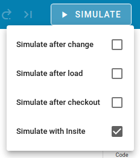

Usage Guide with Insite
=======================

This is a guide to show how to use NEST Desktop with Insite.

Insite is a recording backend module which is also integrated in NEST Simulator.
Basically, with Insite neuronal or network activity can be observed during the simulation.

.. note::

  Simulation with Insite needs to run with Insite docker images
  ``nest-module`` and ``access-node``.
  Best method is to use Docker Compose that deploys NEST Desktop and Insite.
  For more information, please read the :doc:`deployment guide of Insite </deployer/deploy-insite>`.

|

.. image:: ../_static/img/screenshots/settings-insite.png
  :align: left

**Check if Insite is running**

In the settings page you can check whether the Insite backend is running.

|
|
|
|

**Enable simulation with Insite**

  After successfully ping of the backend Insite Access,
  you can check the item :guilabel:`Simulate with Insite`
  in the menu context (clicking with right mouse button) of the :guilabel:`Simulate` button.

|
|
|
|
|

**Script code for simulation with Insite**

The Insite module has to be loaded in the NEST kernel.
Preferentially load insite module directly after importing nest.
Second, the parameter ``record_to`` of any recording device
(e.g. spike recorder, multimeter or voltmeter) has to been modified:

.. code-block:: python

  import nest
  nest.Install("insitemodule")
  ...

  recorder.set({"record_to": "insite"})
  ...

Now, Insite recording module collects activity events from modified recording devices.
The client receives activity from the Insite ``Access Node`` on another port (default: ``8080``).

For more information about Insite, please visit the official `documentation of Insite <https://vrgrouprwth.github.io/insite/>`__ from the VR Group in RWTH Aachen.

|

**Acknowledgements**

Thanks for integrating Insite in NEST Simulator and NEST Desktop:

  - Simon Oerhl (Conceptual design for Insitification in NEST Desktop)
  - Marcel Krüger (Collaboration of Insitification in NEST Desktop)
