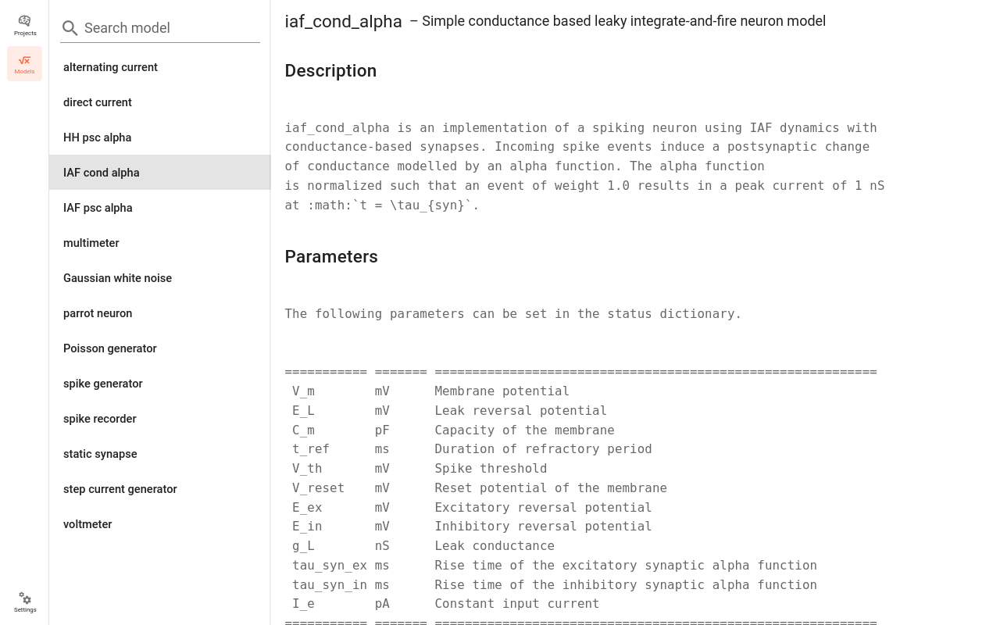

Usage Guide
===========

This guides provides detailed documentation for the Graphical User Interface (GUI) of NEST Desktop.

.. note::
  If you want to see quick start in NEST Desktop we prepared a :doc:`video <index>` showing steps how to construct networks and explore activity.

**Getting Started**

Once you start NEST Desktop, you see the start page a image of a laptop with NEST logo.
At the bottom it shows a short description of NEST Desktop (left) and some useful links and the current version (right).

.. image:: ../_static/img/screenshots/start-page.png
  :width: 100%

|

.. note::
  You can reload the page if NEST Desktop is somehow crashed.

|
|

.. _Construction:

Construct neuronal networks
---------------------------

If you want to construct network, you have to open the network editor.
The network editor shows the network graph composing of nodes (shapes) and connections (lines).

.. image:: ../_static/img/screenshots/network-editor.png
  :width: 100%

|

Here, we explain steps to create and connect nodes.

.. topic:: Create nodes

  .. image:: ../_static/img/gif/create-nodes.gif
    :align: left

  |

  In order to create a new node you click the right mouse button in the network editor, a `pie` panel  with three letters appears to select a element type.
  A node is divided in three element types: stimulus (:guilabel:`S`), recording (:guilabel:`R`) devices and neuron (:guilabel:`N`).
  Then it creates a node of the selected element type.

|
|

**Node labels**

Each node graph is labeled to identify the model of the node.
By default, it creates direct current generator (:guilabel:`dc`) for stimulus, voltmeter (:guilabel:`vm`) for recording devices.
Neuron are just labeled by :guilabel:`n`.
You can find the full label of the node model in the network controller.

.. image:: ../_static/img/screenshots/node-shapes.png
  :align: right

**Node colors**

Nodes and connections contains parameter configurations which are displayed in the controller panel in the side navigation.
The color of nodes helps you to associate the network graph with the controller as well as the visualization of the network activity.
The color of lines is defined by the source node.

**Node shapes**

The specific shape defines an element type of a node:

  - **Hexagon:** A stimulus device alias stimulator is an instrument which only produces signals towards target nodes.
  - **Parallelogram:** A recording device alias recorder is also an instrument which observe states of a recordable node.
  - **Square/Triangle/Circle:** A neuron node is the core engine of neuronal network model which received inputs from other nodes and produces specific output using intrinsic equation.

**Neuron shapes**

.. image:: ../_static/img/screenshots/neuron-shapes.png
  :align: right

The shape of neurons is differently represented by the set of synaptic weight of their connections.

  - **Square:** Neurons without connections or mixed (positive and negative) synaptic weights to neurons.
  - **Triangle:** Neurons with excitatory connections to neurons. All synapse weights are positive.
  - **Circle:** Neurons with inhibitory connections to neurons. All synapse weights are negative.

**Connect nodes**

.. image:: ../_static/img/gif/connect-nodes.gif
  :width: 240px
  :align: left

|

Forming a network of nodes is defined by making connections between and within nodes.
In order to connect nodes, you click a connector of a node, then move the mouse towards other node and finally click a target node.
It creates a connection between source and target nodes.

.. note::
  By pressing the hotkey ``ALT`` and clicking a node at the same time,
  you enable the connecting mode or continue connecting other nodes.

|
|

**Select model and parameters**

.. image:: ../_static/img/gif/edit-node.gif
  :width: 320px
  :align: right

You are able to select model of a node in the network controller.
Then it shows a list of parameters which you want to work on.
Finally, you are able to change values of visible parameters.

|

**Network history**

.. image:: ../_static/img/gif/network-history.gif
  :align: right

With network changes it makes a snapshot of the network afterwards and push to the network history list.
With this network history you can undo or redo the network changes.
A load from a network from the history is called `checkout network`.

|

.. _Simulation:

Simulate neuronal networks
--------------------------

  .. image:: ../_static/img/gif/simulation-button.gif
    :align: right

You can click :guilabel:`Simulate` button to start the simulation of your network. In the code editor you can have an insight on scripted code.

|

.. image:: ../_static/img/screenshots/code-editor.png
  :width: 360px
  :align: right

**Code editor**

NEST Desktop generates textual code from the constructed network.
The generated code can be applied in any Python interpreter.
Here, the code semantics of the NEST Simulator is understandable and easily to learn.

The graphical representatives of the nodes deliver arguments to the block of ``nest.Create(*)`` function.
Next, connections supply specification for the block of ``nest.Connect(*)`` function.
The function ``nest.Simulate(*)`` triggers simulation of your constructed network.
All recording nodes fills a block to collect activities containing neuronal properties, e.g. node ids and positions, and activity events.

|
|
|
|
|

Explore network activity
------------------------

.. image:: ../_static/img/screenshots/activity-explorer.png
  :width: 100%

Network activity is composed of neuronal properties (positions and ids of neurons) and recorded events from recording devices.
Events can be subdivided in two groups: spike events or analog signals.
Spike events contains times and ids of the senders emitting events to the recording devices which can be considered as collectors (``spike detector``).
Analog signals contains continuous quantities from the recording devices aka samplers (``voltmeter`` or ``multimeter``) interrogate their targets at given time intervals.
Network activity can be explored in a graph or table.

**Activity graph**

.. image:: ../_static/img/screenshots/activity-graph.png
  :width: 360px
  :align: left

It displays either a chart graph or animated 3D graph for the spatial network forming layers in topology which neurons has geographical positions.
The chart graph contains graphical panels organized in vertical stacks.
Chart panels is introduced specifically to explore network activity with mouse interaction.
It visualizes scatter graph for spike activity, line graph for analog signals.
When you add one or more sub-panels for spike activity it shows a histogram graph of spike times or of inter-spike intervals.

|
|

**Activity table**

.. image:: ../_static/img/screenshots/activity-table.png
  :width: 320px
  :align: right

You can go to the table by clicking on :guilabel:`Activity statistics` button in the right side navigation.
A table shows simple statistics of recorded elements (rows) of a node (population) connected to a recording device.

In spike events, columns shows spike counts, mean and standard deviation of :math:`ISI` (inter-spike interval) as well as :math:`CV_{ISI}` (Coefficient of variation in inter-spike interval).

In analog signals (e.g. membrane potentials), columns shows :math:`\mu` (mean) and :math:`\sigma` (standard deviation) of analog signal values.

|
|
|
|
|
|
|

Manage projects
---------------

.. image:: ../_static/img/gif/manage-projects.gif
  :width: 320px
  :align: left

NEST Desktop has project management helping you to organize your networks and network activity.
If you want to explore activity of the project, you have to start the simulation (See :ref:`Simulation`).

Clicking on a :guilabel:`New project` creates a new project where you can construct network from the scratch (See :ref:`Construction`).
It is useful to give project a proper name that you can recognize your projects.

|
|

Below the search field it shows projects.
Clicking right mouse button on a project item shows a menu with options to reload, duplicate, download or delete it.
In the projects menu, you find methods to reload, download, upload, delete or reset projects.

.. note::
  Unless you click on save button, the project is not stored in dababase and is lost when you reload the page.

  An important remark is that it stores only project with neuronal networks in database and activity will be lost after page reload.

|

Explore neuron models and devices
---------------------------------

|

The model page provides you detailed documentation of models.
