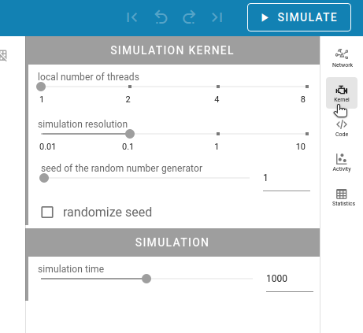

Usage Guide
===========

This guides provides detailed documentation for the Graphical User Interface (GUI) of NEST Desktop.

.. note::
   If you want to see a quick start guide for in NEST Desktop, we have prepared a :doc:`video <index>` showing the steps
   how to construct networks and explore activity.

|br|

.. _getting-started:

**Getting Started**

Once you start NEST Desktop, you can see the start page
containing an image of a laptop with the NEST logo on its screen.
At the bottom it shows a short description of NEST Desktop (left) and some useful links and the current version (right).

.. image:: ../_static/img/screenshots/start-page.png
  :width: 100%
  :target: #getting-started

.. note::
   You can reload the page if NEST Desktop has somehow crashed.

|br|

.. _construct-neuronal-networks:

Construct neuronal networks
---------------------------

If you want to construct a network, you will have to open the network editor.
The network editor shows the network graph composing of nodes (shapes) and connections (lines).

.. image:: ../_static/img/screenshots/network-editor.png
  :width: 100%
  :target: #construct-neuronal-networks

|br|

Here, we explain steps to create and connect nodes.

|br|

.. _create-nodes:

**Create nodes**

.. image:: ../_static/img/gif/create-nodes.gif
  :align: left
  :target: #create-nodes

In order to create a new node, you can click with the right mouse button in the network editor
and a `pie` panel with three letters appears to select an element type.
A node is divided into three element types:
stimulus (:guilabel:`S`), recording (:guilabel:`R`) device and neuron (:guilabel:`N`).
Then it creates a node of the selected element type.

|br|

.. _node-labels:

**Node labels**

Each node graph is labeled to identify the model of the node.
By default, it creates direct current generator (:guilabel:`dc`) for a stimulus
and a voltmeter (:guilabel:`vm`) for a recording device.
Neurons are just labeled with :guilabel:`n`.
You can find the full label of the node model in the network controller.

|br|

.. _node-colors:

**Node colors**

.. image:: ../_static/img/screenshots/node-shapes.png
  :align: right
  :target: #node-colors

Nodes and connections contain parameter configurations
which are displayed in the controller panel in the side navigation.
The color of nodes helps you to associate the network graph with the controller
as well as the corresponding visualization of the network activity.
The color of lines is defined by the source node.

|br|

**Node shapes**

The specific shape defines an element type of a node:

- **Hexagon:** A stimulus device alias stimulator is an instrument
  which only produces signals towards target nodes.
- **Parallelogram:** A recording device alias recorder is also an instrument
  which observes states of a recordable node.
- **Square/Triangle/Circle:** A neuron node is the core engine of a neuronal network model
  which received inputs from other nodes and produces specific output using intrinsic equation.

|br|

.. _neuron-shapes:

**Neuron shapes**

.. image:: ../_static/img/screenshots/neuron-shapes.png
  :align: right
  :target: #neuron-shapes

The shape of neurons is represented differently by the set of synaptic weights of their connections.

- **Square:** Neurons without connections or mixed (positive and negative) synaptic weights to neurons
- **Triangle:** Neurons with excitatory connections to neurons (all synapse weights are positive)
- **Circle:** Neurons with inhibitory connections to neurons (all synapse weights are negative)

|br|

.. _connect-nodes:

**Connect nodes**

.. image:: ../_static/img/gif/connect-nodes.gif
  :align: left
  :target: #connect-nodes
  :width: 240px

Forming a network of nodes is defined by making connections between and within nodes.
In order to connect nodes, you can click on a connector of a node,
then move the mouse towards anther node and finally click on a target node.
It creates a connection between source and target nodes.

.. note::
   By pressing the hotkey ``ALT`` and clicking a node at the same time,
   you enable the connecting mode or continue connecting other nodes.

|br|

.. _select-model-and-parameters:

**Select model and parameters**

.. image:: ../_static/img/gif/edit-node.gif
  :align: right
  :target: #select-model-and-parameters
  :width: 320px

You are able to select the model of a node in the network controller.
Then it shows a list of parameters which you might want to work on.
Finally, you are able to change the values of visible parameters.

|br|

.. _network-history:

**Network history**

.. image:: ../_static/img/gif/network-history.gif
  :align: right
  :target: #network-history

After every network changes, it automatic snapshot of the network it created
and pushed to the network history list.
With this network history you can undo or redo the network changes.
Loading a snapshot from this history is called `checkout network`.

|br|

.. _simulate-neuronal-networks:

Simulate neuronal networks
--------------------------

.. image:: ../_static/img/gif/simulation-button.gif
  :align: right
  :target: #simulate-neuronal-networks

You can click on the :guilabel:`Simulate` button to start the simulation of your network.
In the code editor you can have an insight into the generated script code
(see below for further information).

|br|

.. _kernel-settings:

**Kernel settings**

The simulation parameters can be adjusted in the right sidebar.
They are contained in the NEST Simulator code (more information below),
so they will be passed to the NEST Simulator
whenever a simulation is started.
In the Kernel settings, the slider 'local number of threads' allows to set the number of processes
used by the NEST Simulator.
Please be aware that the shown number of threads does not match the number of processors
used by the NEST Simulator machine.
Therefore, selecting a number that is too large could lead to freezes on the NEST Simulator machine.

It is possible to select the simulation resolution.
Here, you should be aware of the created load on the NEST Simulator as well:
small values for the resolution size create many calculations and data points.
Therefore, selecting small values for the simulation resolution can lead to freezes and lags,
so please be patient when you choose a small number. :)

The seed of the random number generator can also be chosen.
It is possible to choose a randomized seed.

The simulation time can be set as well (in Milliseconds).

|br|

.. _code-editor:

**Code editor**

.. image:: ../_static/img/screenshots/code-editor.png
  :align: right
  :target: #code-editor
  :width: 360px

NEST Desktop generates textual code from the constructed network.
The generated code can be executed in any Python interpreter.
This way, the code semantics of the NEST Simulator is understandable and easily to learn.

The graphical representatives of the nodes deliver arguments to the block of the ``nest.Create(*)`` function.
Next, connections supply a specification for the block of the ``nest.Connect(*)`` function.
The function ``nest.Simulate(*)`` triggers the simulation of your constructed network.
All recording nodes fill a block to collect activities containing neuronal properties,
e.g. node ids and positions, and activity events.

|br|

Explore network activity
------------------------

.. image:: ../_static/img/screenshots/activity-explorer.png
  :target: #explore-network-activity
  :width: 100%

The network activity is composed of neuronal properties (positions and ids of neurons)
and recorded events from recording devices.
Events can be subdivided in two groups: spike events and analog signals.
Spike events contain times and ids of the senders emitting events to the recording devices
which can be considered as collectors (``spike recorder``).
Analog signals contain continuous quantities from the recording devices
aka samplers (``voltmeter`` or ``multimeter``)
which query their targets at given time intervals.
Network activity can be explored in a graph or table.

|br|

.. _activity-graph:

**Activity graph**

.. image:: ../_static/img/screenshots/activity-graph.png
  :align: left
  :target: #activity-graph
  :width: 360px

It displays either a chart graph or an animated 3D graph for the spatial network forming layers in topology
whose neurons have geographical positions.
The chart graph contains graphical panels organized in vertical stacks.
Chart panels are introduced specifically to explore the network activity by mouse interaction.
It uses a scatter graph to visualize spike activity and a line graph to visualize analog signals.
When you add one or more sub-panels for spike activity
it shows a histogram graph of spike times or of inter-spike intervals.

|br|

.. _activity-table:

**Activity table**

.. image:: ../_static/img/screenshots/activity-table.png
  :align: right
  :target: #activity-table
  :width: 320px

You can go to the table by clicking on the
| :guilabel:`Activity statistics` button in the right side navigation.
A table shows simple statistics of recorded elements (rows) of a node (population) connected to a recording device.

In spike events, the columns show the spike counts, mean and standard deviation of :math:`ISI` (inter-spike interval)
as well as :math:`CV_{ISI}` (Coefficient of variation in inter-spike interval).

In analog signals (e.g. membrane potentials), the columns show the :math:`\mu` (mean)
and :math:`\sigma` (standard deviation) of analog signal values.

|br|

.. _manage-projects:

Manage projects
---------------

.. image:: ../_static/img/gif/manage-projects.gif
  :align: left
  :target: #manage-projects
  :width: 320px

NEST Desktop has a project management helping you to organize your networks and network activity.
If you want to explore the network activity of the project,
you will have to start the simulation (see :ref:`simulate-neuronal-networks`).

Clicking on :guilabel:`New project` creates a new project
where you can construct a network from the scratch (see :ref:`construct-neuronal-networks`).
It is useful to give project a proper name so that you can recognize your projects.

|br|

Below the search field it shows a list of the projects.
Clicking with right mouse button on a project item
shows a menu with options to reload, duplicate, export or delete a project.
In the projects menu, you can find methods to reload, export, import, delete
or reset single or multiple projects.

.. note::
   Unless you click on the save button, the project is not stored in the database of the web page cookie
   and is lost when you reload the page!

   An important remark is that it stores only projects with neuronal networks in that database,
   but all activity will be lost after page reload!

.. |br| raw:: html

  

